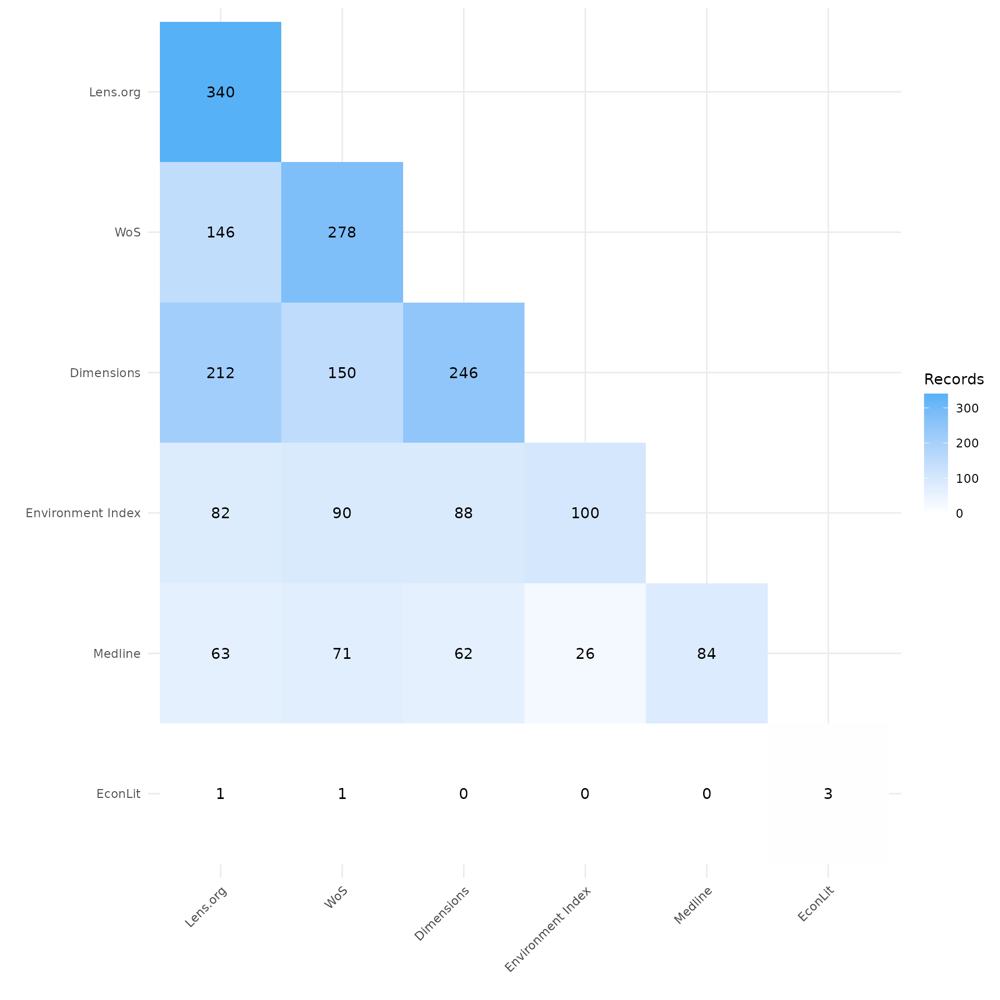
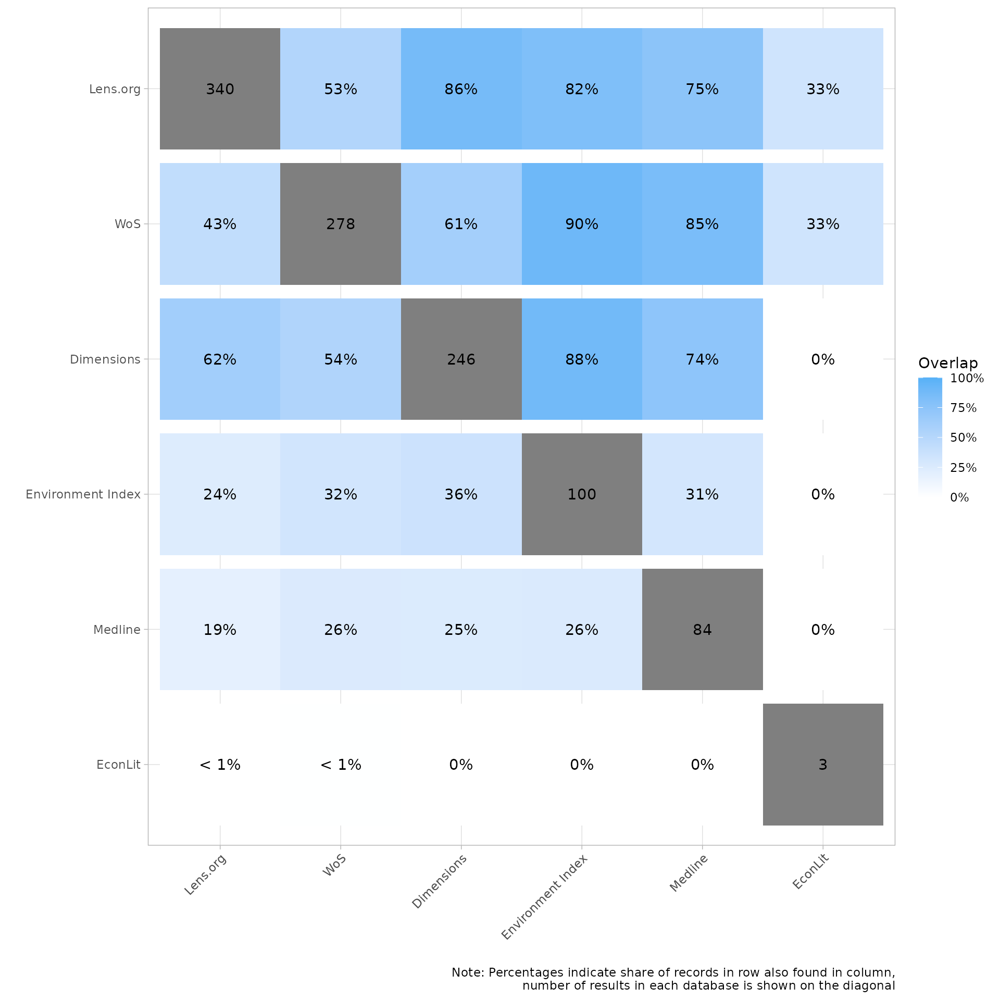
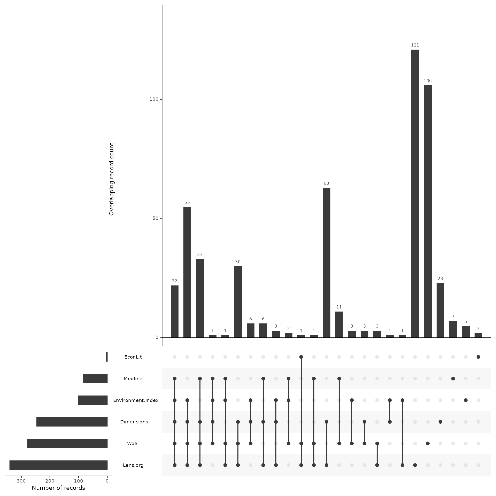
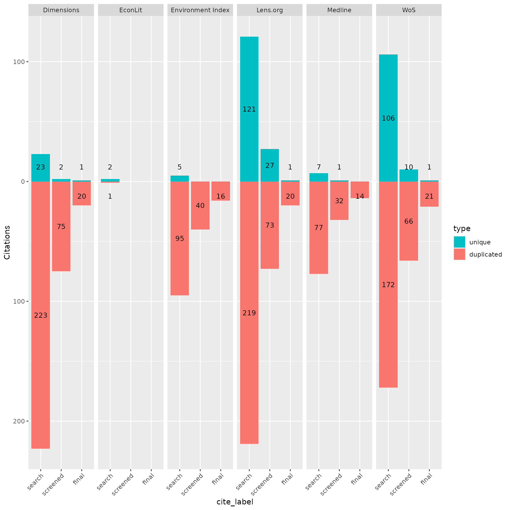

# Analysis Across Screening Phases

## About this vignette

This vignette was created in order to show how CiteSource can assist in
assessing the impact of sources and methods in the context of an
evidence synthesis project.

In order to complete a reliable systematic search one must include
multiple resources to ensure the inclusion of all relevant studies. The
exact number of sources that are necessary for a thorough search can
vary depending on the topic, type of review, etc. Along with the
selection and search of traditional literature sources, the application
of other methods such as hand searching relevant journals, citation
chasing/snowballing, searching websites, collecting literature from
stakeholders, etc. can be used to minimize the risk of missing relevant
studies.

When developing a search strategy teams often don’t understand the
potential impact of a particular resources or search method. Questions
can arise about how critical a particular database is or question the
return on investment of weeks of gray literature searching on the web.
While the answers to these questions will vary based on the topic and
scope of a project, CiteSource can assist in better informing the
Evidence Synthesis community when data from projects are shared

The goal of this vignette is to show you how CiteSource can help you
gather information on the ways sources and methods impact a review. The
data in this vignette is based on a mock project. It looks at the result
of searches for systematic reviews and meta-analyses on the health,
environmental and economic impacts of wildfires. We’ll walk through how
CiteSource can import original search results, compare those information
sources and methods, and determine how each source and method
contributed to the final review.

If you have any questions, feedback, ideas, etc. about this vignette or
others be sure to check out our [discussion
board](https://github.com/ESHackathon/CiteSource/discussions/100) on
github!

## 1. Install and load CiteSource

Use the following code to install CiteSource. Currently, CiteSource
lives on GitHub, so you may need to first install the remotes package.

``` r
#Install the remotes packages to enable installation from GitHub
#install.packages("remotes")
#library(remotes)

#Install CiteSource
#remotes::install_github("ESHackathon/CiteSource")

#Load the CiteSource
library(CiteSource)
```

## 2. Import citation files

Start by importing multiple .ris or .bib files into CiteSource. When
working from a local directory you will need to provide the path to
folder that contains the files you wish to upload. You can print
citation_files to your console to ensure all the files you expect are
there and to see their order, which will be important in labeling the
data.

CiteSource works with .ris and .bib files straight from any
database/resource, however, the deduplication functionality relies on
the metadata provided. Higher quality metadata will ensure more accurate
results.

``` r
#Import citation files from a folder
file_path <- "../vignettes/new_stage_data/"
citation_files <- list.files(path = file_path, pattern = "\\.ris", full.names = TRUE)

#Print citation_files to double check the order in which R imported the files.
citation_files
#> [1] "../vignettes/new_stage_data//Dimensions_246.ris"
#> [2] "../vignettes/new_stage_data//econlit_3.ris"     
#> [3] "../vignettes/new_stage_data//envindex_100.ris"  
#> [4] "../vignettes/new_stage_data//final_24.ris"      
#> [5] "../vignettes/new_stage_data//lens_343.ris"      
#> [6] "../vignettes/new_stage_data//medline_84.ris"    
#> [7] "../vignettes/new_stage_data//screened_128.ris"  
#> [8] "../vignettes/new_stage_data//wos_278.ris"
```

## 3. Assign custom metadata

NOTE: CiteSource allows you to label records in three custom fields:
cite_source, cite_string, and cite_label. currently cite_source and
cite_label are the primary fields that CiteSource employs, cite_string
operates like cite_label, and there are plans to further integrate this
field into future package functionality

cite_source metadata Using the cite_source field, you will tag files
according to the source or method they were found. In this example we
have two .ris files that represent the citations included after
title/abstract screening and after full-text screening. We have labeled
these files as “NA” in the cite_source field as they do not represent
citations gathered as part of a source or method in the searching phase.

cite_label metadata Using the cite_label field, you will tag files
according to the phase in which they are associated. In this case the
six database files represent the search results and are in turn labeled
“search”. The two citation files (screened and final) are files of
included citations after title/abstract screening and after full-text
screening and are labeled accordingly.

Once we tag these files accordingly we will save them as raw_citations.

``` r
# Create a tibble that contains metadata about the citation files
imported_tbl <- tibble::tribble(
  ~files,                ~cite_sources,        ~cite_labels, 
   "wos_278.ris",        "WoS",                "search",    
   "medline_84.ris",     "Medline",            "search",   
   "econlit_3.ris",      "EconLit",            "search",    
   "Dimensions_246.ris", "Dimensions",         "search",   
   "lens_343.ris",       "Lens.org",           "search",    
   "envindex_100.ris",   "Environment Index",  "search",  
   "screened_128.ris",   NA,                   "screened",  
   "final_24.ris",       NA,                   "final"
) %>% 

dplyr::mutate(files = paste0(file_path, files))
raw_citations <- read_citations(metadata = imported_tbl)
#> Importing files ■■■                                6%
#> Import completed - with the following details:
#>                 file       cite_source cite_string cite_label citations
#> 1        wos_278.ris               WoS        <NA>     search       278
#> 2     medline_84.ris           Medline        <NA>     search        84
#> 3      econlit_3.ris           EconLit        <NA>     search         3
#> 4 Dimensions_246.ris        Dimensions        <NA>     search       246
#> 5       lens_343.ris          Lens.org        <NA>     search       343
#> 6   envindex_100.ris Environment Index        <NA>     search       100
#> 7   screened_128.ris              <NA>        <NA>   screened       128
#> 8       final_24.ris              <NA>        <NA>      final        24
```

## 4. Deduplicate & create data tables

Having added the custom metadata to the files, we are now able to
compare the records within and between the files. CiteSource uses the
ASySD package to identify and merge metadata from duplicate records,
maintaining the cite_source, cite_label,and cite_string fields of each
record. Note that pre-prints and similar results will not be identified
as duplicates, to learn more about the algorithm employed in identifying
duplicate records see (ASySD).

``` r
#Identify overlapping records and consolidate unique citations
unique_citations <- dedup_citations(raw_citations)
#> Registered S3 method overwritten by 'synthesisr':
#>   method                     from      
#>   as.data.frame.bibliography CiteSource
#> formatting data...
#> identifying potential duplicates...
#> identified duplicates!
#> flagging potential pairs for manual dedup...
#> Joining with `by = join_by(duplicate_id.x, duplicate_id.y)`
#> 1206 citations loaded...
#> 690 duplicate citations removed...
#> 516 unique citations remaining!

# Count number of unique and non-unique citations
n_unique <- count_unique(unique_citations)

# Create dataframe indicating occurrence of records across sources
source_comparison <- compare_sources(unique_citations, comp_type = "sources")
```

## 5. Review internal duplication

Once we have imported, added custom metadata, and identified duplicates,
it can be helpful to review the initial record count data to ensure
everything looks okay. As a part of the deduplication process, duplicate
records may have been identified within sources. The initial record
table will provide you with a count of how many records were initially
in each source file, and the count of distinct records that will vary if
there were any duplicates identified within the source file.

In this case, you can see that the Lens.org had 340 records, while the
initial .ris file contained 343 citations. This means that CiteSource
identified duplicate references within that citation list. The 340
remaining citations are attributed to this source. Looking at the source
Medline, we can see that CiteSource did not find any duplicate citations
within this source as both counts read 84.

``` r
# initial upload/post internal deduplication table creation
initial_records <- calculate_initial_records(unique_citations, "search")
initial_record_table <- create_initial_record_table(initial_records)
initial_record_table
```

| Record Counts                                            |                   |                   |
|----------------------------------------------------------|-------------------|-------------------|
|                                                          | Records Imported¹ | Distinct Records² |
| Dimensions                                               | 246               | 246               |
| EconLit                                                  | 3                 | 3                 |
| Environment Index                                        | 100               | 100               |
| Lens.org                                                 | 343               | 340               |
| Medline                                                  | 84                | 84                |
| WoS                                                      | 278               | 278               |
| Total                                                    | 1054              | 1051              |
| ¹ Number of records imported from each source.           |                   |                   |
| ² Number of records after internal source deduplication. |                   |                   |

## 6. Analyze overlap across sources & methods

When teams are selecting databases for inclusion in a review it can be
extremely difficult to determine the best resources and determine the
return on investment in terms of the time it takes to apply searches.
This is especially true in fields where research relies on
cross-disciplinary resources. By tracking and reporting where/how each
citation was found, the evidence synthesis community could in turn track
the utility of various databases/platforms and identify the most
relevant resources as it relates to their research topic. This idea can
be extended to search string comparison as well as various search
strategies and methodologies.

### Heatmaps

Looking at the first heatmap we can see that the heatmap is organized by
source in order of record count. The source count is located at the top
of each of source’s column. The count within the cells represents the
number of records that overlapped between those two sources. Looking at
the records imported from LENS.org we can see of the 340 records, 212
were also found in Dimensions and 146 were found in Web of Science. We
can also see that of the 100 records imported from Environmental Index,
82 were found in LENS.

The second heatmap displays the overlap between sources as a percentage.
The gray cell shows the number of citations imported from the source and
when reading up/down in each column we can see the percent of those
citations that were found in intersecting source. Again, we know that
Environmental Index had 100 records and that 82 of these citations were
also in Lens.org, in this version we can see the overlap reads 82%. On
the other hand if you look at the column for LENS, the same 82 citations
only represent 24% of the 340 citations imported from LENS

``` r
my_heatmap_count <- plot_source_overlap_heatmap(source_comparison)
my_heatmap_count
```



``` r

my_heatmap_percent <- plot_source_overlap_heatmap(source_comparison, plot_type = "percentages")
my_heatmap_percent
```



### Upset Plot

A more powerful way of looking at overlap of sources is through the use
of an upset plot, which provides details on overlap across all sources.
The upset plot also provides information on number of unique
contributions of any given source.

In this example, we can see that the search in EconLit only had three
results, but of those, two were unique and not found in any other
source. We can also see that the single record from EconLit that was not
unique was found in both LENS and Web of Science. Wwe can also see that
Lens.org and Web of Science both contributed by far the most unique
records and that Dimensions and LENS had the greatest overlap, with 63
records shared between them that were not found in any other source.

The upset plot is a powerful visualization tool and can be used in a
number of ways, including for benchmark testing and testing variations
of strings. Be sure to review the other vignettes for applying the upset
plot to other use cases.

``` r
plot_overlap_across_sources <- plot_source_overlap_upset(source_comparison, decreasing = c(TRUE, TRUE))
#> Plotting a large number of groups. Consider reducing nset or sub-setting the data.
plot_overlap_across_sources
```



## 7. Analyze records across Phases

Until now we have only reviewed overlap across sources. In the
following, we will now include the cite_label data as well in order to
track each source’s records across screening phases.

In this case we uploaded an .ris file for all citations that were
included after title and abstract screening as well as after full-text
screening. Using the contributions plot we can easily see the number of
records from each source, both overlapping and unique, across these
phases.

### Assess contribution across phases

Looking at the plot there are three bar plots for each source in the
order search, screened, final. The green bar within each phase is the
count of unique records from that source, while the red bar shows the
number of records from that source that overlapped at least one other
source. In this case we can see that despite the high number of unique
records from LENS and Web of Science, each only contributed a single
unique citation in the end.

``` r
plot_contributions_over_phases <- plot_contributions(n_unique,
  center = TRUE,
  bar_order = c("search", "screened", "final")
)

plot_contributions_over_phases
```



## 8. Analyze data with tables

Visualizations are great, but so are tables! CiteSource provides the
ability to create tables for additional analysis. Presenting data in the
form of a search summary table can provide an overview of each source’s
impact (see [Bethel et al. 2021](https://doi.org/10.5195/jmla.2021.809)
for more about search summary tables).

### Detailed record table

The detailed record provides more details regarding unique records.
Let’s break down the columns.

Starting with the first two columns, we can see that this is the same
data that was provided in the initial record table. Since the number of
records imported and the actual number of distinct records from that
source may differ, this information is provided again due to the fact
that the distinct record count is what calculations are based on. The
one difference here is that the total distinct records in this table is
the number after deduplication, this is done in order to give an
accurate number of records that were screened.

The next two columns, Unique Records and Non-unique Records, simply
shows the number of those distinct records that were either unique or
non-unique.

The source contribution column gives the percent of distinct records
that source contributed to the total number of distinct records. For
example, we know there were 1051 distinct records before deduplication,
since LENS had 340 distinct records (down from 343 after internal
deduplication), the percent of records contributed before deduplication
was 32.4%. Having 121 of the 264 total unique citations, the percent of
unique sources contributed is 45.8%

The final column shows the percent of records that were unique within
each source. In the case of Environmental Index we can easily see that
the source unique percent of 5% is the lowest of any source.

``` r
detailed_count<-calculate_detailed_records(unique_citations, n_unique, "search")
create_detailed_record_table(detailed_count)
```

| Record Summary                                                                  |                   |                   |                 |                     |                        |                               |                  |
|---------------------------------------------------------------------------------|-------------------|-------------------|-----------------|---------------------|------------------------|-------------------------------|------------------|
|                                                                                 | Records Imported¹ | Distinct Records² | Unique Records³ | Non-unique Records⁴ | Source Contribution %⁵ | Source Unique Contribution %⁶ | Source Unique %⁷ |
| Dimensions                                                                      | 246               | 246               | 23              | 223                 | 23.4%                  | 8.7%                          | 9.3%             |
| EconLit                                                                         | 3                 | 3                 | 2               | 1                   | 0.3%                   | 0.8%                          | 66.7%            |
| Environment Index                                                               | 100               | 100               | 5               | 95                  | 9.5%                   | 1.9%                          | 5.0%             |
| Lens.org                                                                        | 343               | 340               | 121             | 219                 | 32.4%                  | 45.8%                         | 35.6%            |
| Medline                                                                         | 84                | 84                | 7               | 77                  | 8.0%                   | 2.7%                          | 8.3%             |
| WoS                                                                             | 278               | 278               | 106             | 172                 | 26.5%                  | 40.2%                         | 38.1%            |
| Total                                                                           | 1054              | ⁸ 516             | 264             | 787                 | NA                     | NA                            | NA               |
| ¹ Number of raw records imported from each database.                            |                   |                   |                 |                     |                        |                               |                  |
| ² Number of records after internal source deduplication.                        |                   |                   |                 |                     |                        |                               |                  |
| ³ Number of records not found in another source.                                |                   |                   |                 |                     |                        |                               |                  |
| ⁴ Number of records found in at least one other source.                         |                   |                   |                 |                     |                        |                               |                  |
| ⁵ Percent distinct records contributed to the total number of distinct records. |                   |                   |                 |                     |                        |                               |                  |
| ⁶ Percent of unique records contributed to the total unique records.            |                   |                   |                 |                     |                        |                               |                  |
| ⁷ Percentage of records that were unique from each source.                      |                   |                   |                 |                     |                        |                               |                  |
| ⁸ Total citations discovered (after internal and cross-source deduplication).   |                   |                   |                 |                     |                        |                               |                  |

### Precision/Sensitivity Table

Like the contributions plot, the precision/sensitivity table takes into
consideration data from screening phases. Alongside the distinct
records, and records included a the title/abstract and screening phases
for each source, the table also calculates the precision and sensitivity
(also known as recall). This table does not differentiate overlapping
vs. unique records.

In our example, we can see that of the 340 records from LENS, 100 were
included after title/abstract screening, and 16 were included after
full-text screening.

### **Precision Calculation in the Function**:

The function calculates precision as:

$$\text{Precision} = \frac{\text{Final Records from Source}}{\text{Distinct Records from Source}}$$

- Final Records from Source (`final`): The number of records from a
  specific source that were included in the final synthesis.
- Distinct Records from Source (`Distinct Records`): The total number of
  unique records (after deduplication) from that source.

### **Sensitivity Calculation in the Function**:

The function calculates recall as:

$$\text{Recall} = \frac{\text{Final Records from Source}}{\text{Total Final Records Across All Sources}}$$

- Final Records from Source (`final`): The number of records from a
  specific source that were included in the final synthesis.
- Total Final Records Across All Sources(`Total final records`): The
  total number of records that made it into the final synthesis from all
  sources combined.

``` r
phase_count<-calculate_phase_records(unique_citations, citations, "cite_source")
create_precision_sensitivity_table(phase_count)
```

| Record Counts & Precision/Sensitivity                                              |                   |                    |                 |            |                     |
|------------------------------------------------------------------------------------|-------------------|--------------------|-----------------|------------|---------------------|
|                                                                                    | Distinct Records¹ | Screened Included² | Final Included³ | Precision⁴ | Sensitivity/Recall⁵ |
| Dimensions                                                                         | 246               | 77                 | 21              | 8.54       | 87.50               |
| EconLit                                                                            | 3                 | 0                  | 0               | 0.00       | 0.00                |
| Environment Index                                                                  | 100               | 40                 | 16              | 16.00      | 66.67               |
| Lens.org                                                                           | 340               | 100                | 21              | 6.18       | 87.50               |
| Medline                                                                            | 84                | 33                 | 14              | 16.67      | 58.33               |
| WoS                                                                                | 278               | 76                 | 22              | 7.91       | 91.67               |
| Total                                                                              | ⁶ 516             | ⁷ 126              | ⁸ 24            | ⁹ 4.65     | NA                  |
| ¹ Number of records after internal source deduplication.                           |                   |                    |                 |            |                     |
| ² Number of citations included after title/abstract screening.                     |                   |                    |                 |            |                     |
| ³ Number of citations included after full text screening.                          |                   |                    |                 |            |                     |
| ⁴ Number of final included citations / Number of distinct records.                 |                   |                    |                 |            |                     |
| ⁵ Number of final included citations / Total number of final included citations.   |                   |                    |                 |            |                     |
| ⁶ Total citations discovered (after internal and cross-source deduplication).      |                   |                    |                 |            |                     |
| ⁷ Total citations included after Ti/Ab Screening.                                  |                   |                    |                 |            |                     |
| ⁸ Total citations included after full text screening.                              |                   |                    |                 |            |                     |
| ⁹ Overall Precision = Number of final included citations / Total distinct records. |                   |                    |                 |            |                     |

## 9. Record level table

Another useful table that can be exported as a .csv is the record-level
table. This table allows users to quickly identify which individual
citations in the screened and/or final records were present/absent from
each source. The source tag is the default (include = “sources”), but
can be replaced or expanded with ‘labels’ and/or ‘strings’

``` r
citation_table_final<-unique_citations %>%
  dplyr::filter(stringr::str_detect(cite_label, "final")) %>%
  record_level_table(return = "DT")

citation_table_final
```

## 10. Exporting for further analysis

We may want to export our deduplicated set of results (or any of our
dataframes) for further analysis or to save them in a convenient format
for subsequent use. CiteSource offers a set of export functions called
`export_csv`, `export_ris` and `export_bib` that will save dataframes as
a .csv file, .ris file or .bib file, respectively.

You can then reimport exported files to pick up a project or analysis
without having to start from scratch, or after making manual adjustments
(such as adding missing abstract data) to a file.

### Generate a .csv file

The separate argument can be used to create separate columns for
cite_source, cite_label or cite_string to facilitate analysis.

``` r
#export_csv(unique_citations, filename = "citesource_export_phases.csv")
```

### Generate a .ris file

Generate and .ris and indicate custom field location for cite_source,
cite_label or cite_string. In this example, we’ll be using EndNote, so
we put cite_sources in the DB field, which will appear as the “Name of
Database” field in EndNote and cite_labels into C5, which will appear as
the “Custom 5” metadata field in EndNote.

``` r
#export_ris(unique_citations, filename = "citesource_export.ris", source_field = "DB", label_field = "C5")
```

### Generate a bibtex file

Generate a bibtex file and include data from cite_source, cite_label or
cite_string.\*\*

``` r
#export_bib(unique_citations, filename = "citesource_export.bib", include = c("sources", "labels", "strings"))
```

### Re-import a CiteSource exported file

In order to reimport a .csv or a .ris you can use the following. Here is
an example of how you would re-import the file if it were on your
desktop

``` r
#citesource_working_example <-reimport_csv("citesource_export.csv")

#citesource_working_example <-reimport_ris("citesource_export.ris")
```
