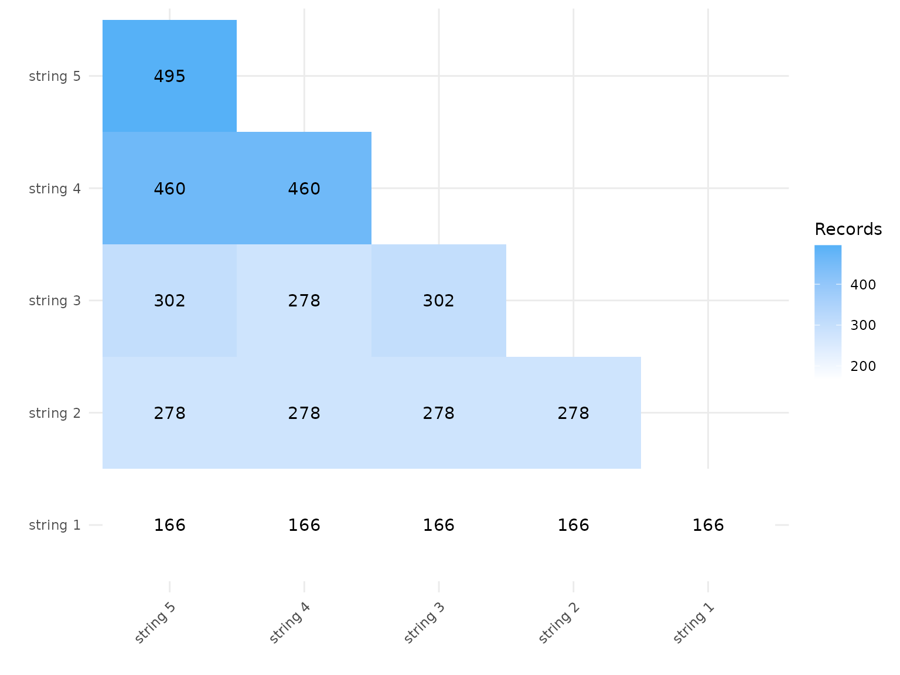
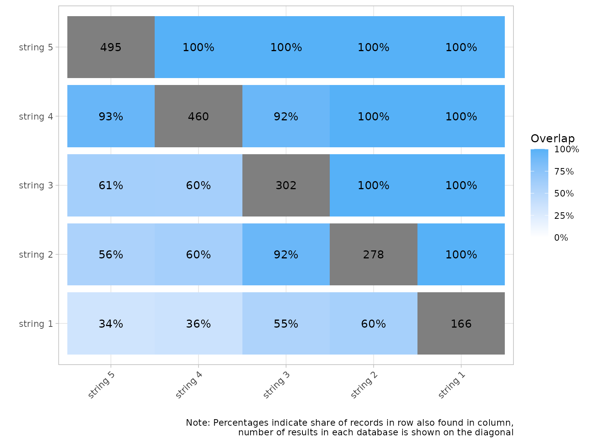
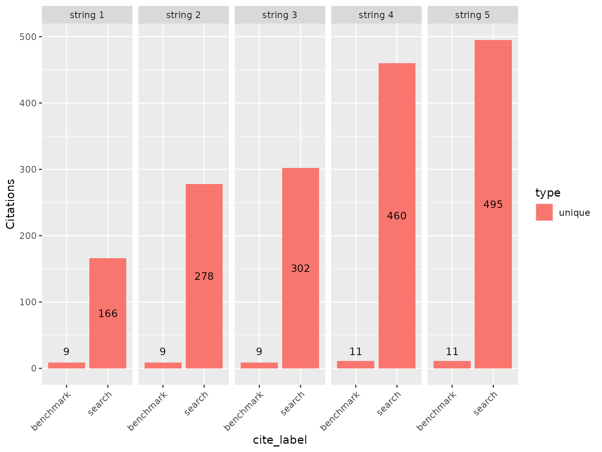

# Comparing Search Strings

## About this vignette

CiteSource provides three custom metadata fields for labeling citation
records: `cite_source`, `cite_label`, and `cite_string`. Most workflows
use `cite_source` to identify the database and `cite_label` to track the
review stage (search, screened, final). The `cite_string` field provides
a third dimension for cases where you need to distinguish between
variations of a search strategy within the same source.

The most common use case is **within-source string comparison**: you are
testing multiple query formulations in a single database before
finalizing your search strategy, and you want to compare how each
performs without conflating the query variation with the source
identity. Encoding the variations as separate `cite_source` values would
work, but it loses the ability to aggregate results at the database
level. Using `cite_string` keeps the database identity intact while
enabling a separate axis of analysis.

In this example, five search strings were run in Web of Science. We use
`cite_source` to record the database and `cite_string` to label each
query variation, then compare their performance against a set of
benchmark studies.

## Installation and setup

``` r

#install.packages("CiteSource")
library(CiteSource)
```

## Import citation files

``` r

file_path <- "../vignettes/new_benchmark_data/"
citation_files <- list.files(path = file_path, pattern = "\\.ris", full.names = TRUE)
citation_files
#> [1] "../vignettes/new_benchmark_data//benchmark_15.ris"
#> [2] "../vignettes/new_benchmark_data//search1_166.ris" 
#> [3] "../vignettes/new_benchmark_data//search2_278.ris" 
#> [4] "../vignettes/new_benchmark_data//search3_302.ris" 
#> [5] "../vignettes/new_benchmark_data//search4_460.ris" 
#> [6] "../vignettes/new_benchmark_data//search5_495.ris"
```

## Assign metadata using all three fields

The key difference from a standard import: `cite_source` is the same
database (“WoS”) for all search strings, while `cite_string`
differentiates the query variations. The benchmark file gets
`cite_source = NA` and `cite_label = "benchmark"`.

``` r

imported_tbl <- tibble::tribble(
  ~files,              ~cite_sources,  ~cite_labels,  ~cite_strings,
  "benchmark_15.ris",  NA,             "benchmark",   NA,
  "search1_166.ris",   "WoS",          "search",      "string 1",
  "search2_278.ris",   "WoS",          "search",      "string 2",
  "search3_302.ris",   "WoS",          "search",      "string 3",
  "search4_460.ris",   "WoS",          "search",      "string 4",
  "search5_495.ris",   "WoS",          "search",      "string 5"
) |>
  dplyr::mutate(files = paste0(file_path, files))

raw_citations <- read_citations(metadata = imported_tbl, verbose = FALSE)
#> Note: the following cite_label value(s) are not in the standard vocabulary (search / screened / final): benchmark. Phase-analysis functions expect these exact labels.
```

## Deduplicate and create comparison data

``` r

unique_citations <- dedup_citations(raw_citations)
#> formatting data...
#> identifying potential duplicates...
#> identified duplicates!
#> flagging potential pairs for manual dedup...
#> 1716 citations loaded...
#> 1217 duplicate citations removed...
#> 499 unique citations remaining!
n_unique         <- count_unique(unique_citations)

# Compare by string rather than source
string_comparison <- compare_sources(unique_citations, comp_type = "strings")
```

## Review initial record counts

``` r

initial_records <- calculate_initial_records(unique_citations)
create_initial_record_table(initial_records)
```

| Record Counts |  |  |
|----|----|----|
|  | Records Imported¹ | Distinct Records² |
| WoS | 1701 | 495 |
| NA | 4 | 4 |
| Total | 1705 | 499 |
| ¹ Number of records imported from each source. |  |  |
| ² Number of records after internal source deduplication. |  |  |

## Visualize overlap between strings

### Upset plot by string

The upset plot shows how records are distributed across string
combinations. This tells you which strings are finding records the
others miss and how much overlap exists between query variations.

``` r

plot_source_overlap_upset(string_comparison, groups = "string", decreasing = c(TRUE, TRUE))
```


### Heatmap by string

The heatmap provides a pairwise view of overlap between strings, either
as raw counts or as percentages.

``` r

plot_source_overlap_heatmap(string_comparison, cells = "string")
```



``` r

plot_source_overlap_heatmap(string_comparison, cells = "string", plot_type = "percentages")
```



## Compare string contributions

[`plot_contributions()`](https://www.eshackathon.org/CiteSource/reference/plot_contributions.md)
shows unique and shared record counts for each string. Strings with a
high proportion of unique records are contributing coverage that the
other strings miss; strings with mostly shared records may be redundant.

``` r

plot_contributions(n_unique, facets = cite_string, center = TRUE)
```



## Benchmark coverage by string

Filtering to the benchmark records and using the record-level table
shows exactly which benchmark studies each string found — and which were
missed entirely.

``` r

unique_citations |>
  dplyr::filter(stringr::str_detect(cite_label, "benchmark")) |>
  record_level_table(return = "DT")
```

## Detailed contribution table by string

``` r

detailed_records <- calculate_detailed_records(unique_citations, n_unique)
create_detailed_record_table(detailed_records)
```

| Record Summary |  |  |  |  |  |  |  |
|----|----|----|----|----|----|----|----|
|  | Records Imported¹ | Distinct Records² | Unique Records³ | Non-unique Records⁴ | Source Contribution %⁵ | Source Unique Contribution %⁶ | Source Unique %⁷ |
| WoS | 1701 | 495 | 1701 | -1206 | 99.2% | 100.0% | 343.6% |
| NA | 4 | 4 | NA | NA | 0.8% | NA | NA |
| Total | 1705 | ⁸ 499 | 1701 | -1206 | NA | NA | NA |
| ¹ Number of raw records imported from each database. |  |  |  |  |  |  |  |
| ² Number of records after internal source deduplication. |  |  |  |  |  |  |  |
| ³ Number of records not found in another source. |  |  |  |  |  |  |  |
| ⁴ Number of records found in at least one other source. |  |  |  |  |  |  |  |
| ⁵ Percent distinct records contributed to the total number of distinct records. |  |  |  |  |  |  |  |
| ⁶ Percent of unique records contributed to the total unique records. |  |  |  |  |  |  |  |
| ⁷ Percentage of records that were unique from each source. |  |  |  |  |  |  |  |
| ⁸ Total citations discovered (after internal and cross-source deduplication). |  |  |  |  |  |  |  |

## When to use cite_string vs cite_source

| Scenario | Recommended field |
|----|----|
| Different databases (PubMed, Scopus, WoS) | `cite_source` |
| Same database, different query variations | `cite_string` |
| Hand searching, citation chasing alongside database searches | `cite_string` (method) + `cite_source` (target) |
| Tracking records through review stages | `cite_label` |

For most reviews, `cite_source` and `cite_label` are sufficient.
`cite_string` becomes valuable when you are doing pre-search validation
with multiple query variants, or when you want to distinguish
supplementary search methods from the primary database searches while
keeping both associated with the same source.
