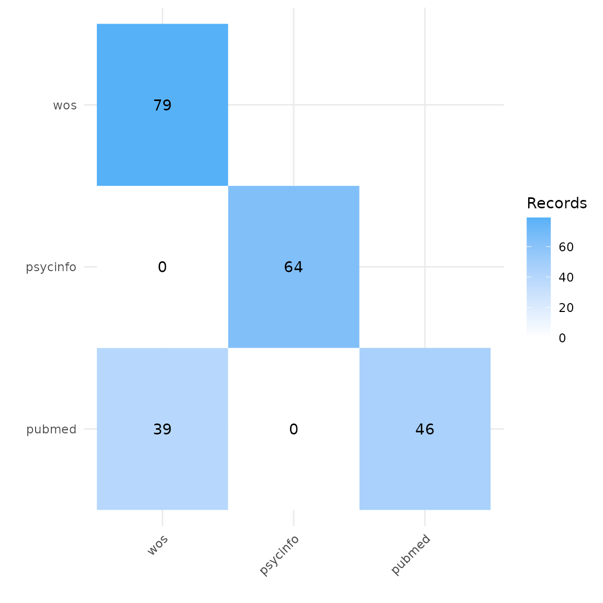
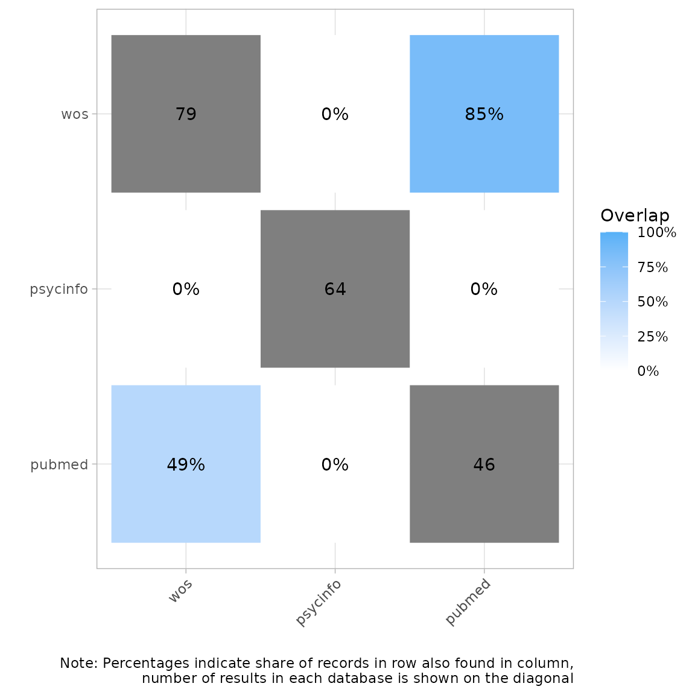
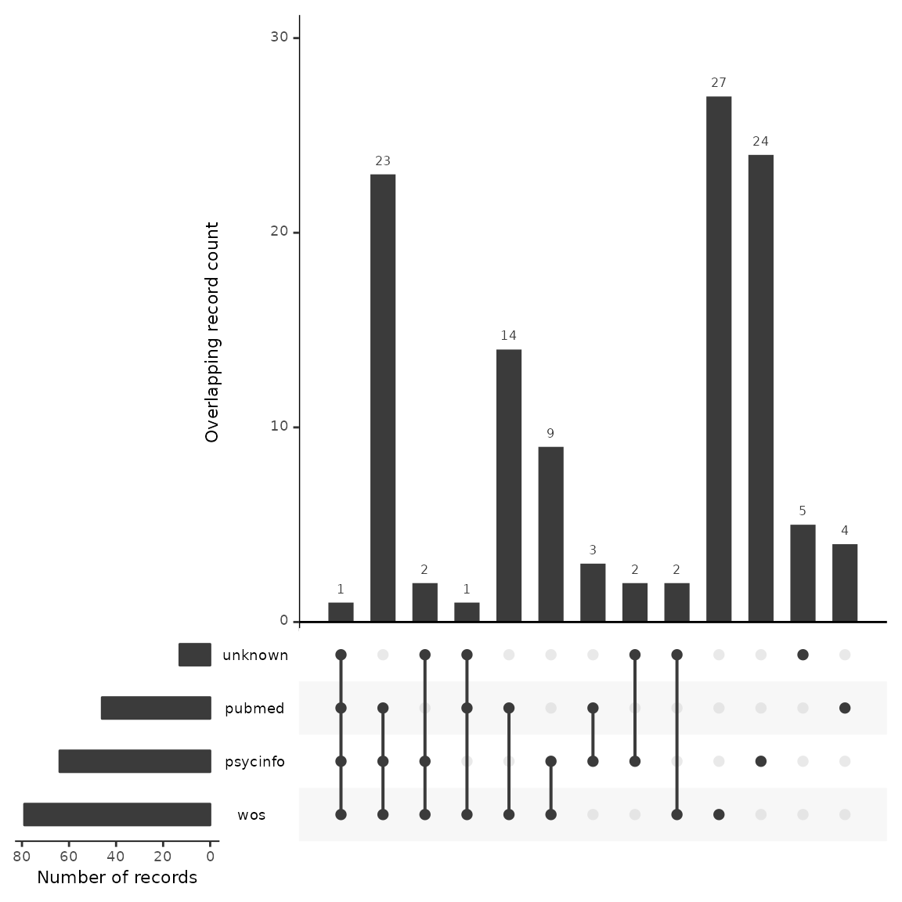
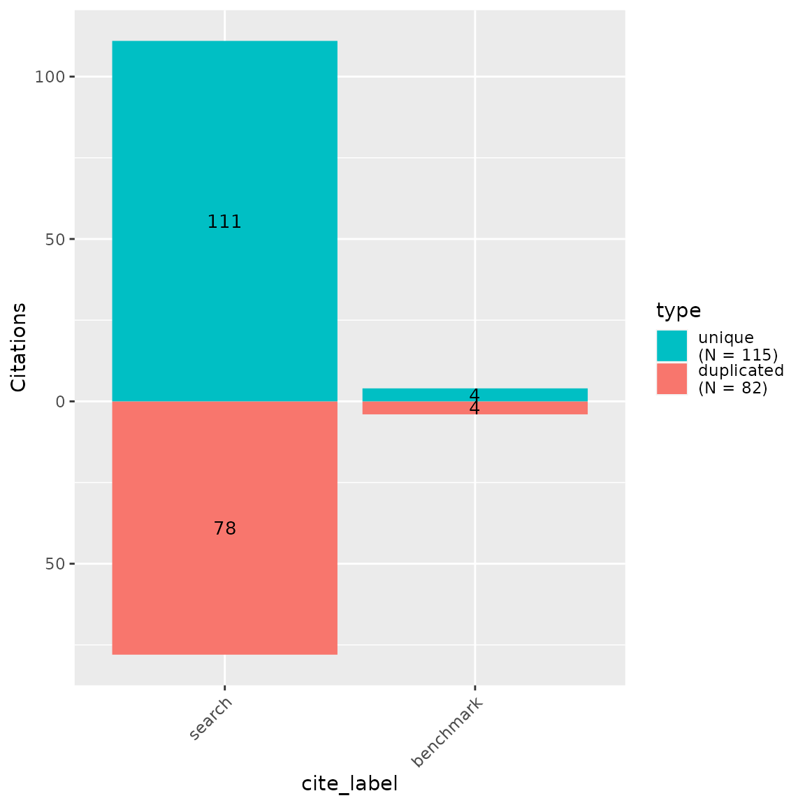

# Assessing Usefulness of Databases for Evidence Synthesis

## About this vignette

In the process of developing search strategies for evidence synthesis,
it is standard practice to test different versions of a search in the
main database and examine the records gained and lost with changes to
the search string and to test different searches against a set of
already known relevant studies (i.e., benchmark studies). In this way,
the right balance between precision and sensitivity can be achieved
prior to screening.

Until now, this within-database testing has been the primary method of
pre-screening search validation. With CiteSource, we can now test search
strategies across databases, to assess the usefulness of certain
databases in a search before finalizing our database set. This adds
another layer of pre-screening search validation that can further
improve precision and sensitivity. This vignette provides a workflow for
testing a search strategy across multiple databases and against a set of
benchmark studies.

In this example, we are running a search about loneliness and gambling
addiction. We developed a search strategy for PsycInfo, our main
database. Now, we’d like to see if searching other databases like Web of
Science and PubMed add useful records and help us find more of our
benchmark studies.

## Installation of packages and loading libraries

Use the following code to install CiteSource. Currently, CiteSource
lives on GitHub, so you may need to first install the remotes package.
This vignette also uses functions from the ggplot2 and dplyr packages.

``` r

#Install the remotes packages to enable installation from GitHub
#install.packages("remotes")
#library(remotes)

#Install CiteSource
#remotes::install_github("ESHackathon/CiteSource")

#Load the necessary libraries
library(CiteSource)
library(dplyr)
```

## Import files from multiple sources

Users can import multiple RIS or bibtex files into CiteSource, which the
user can label with source information such as database or platform.

``` r

#Import citation files from folder
citation_files <- list.files(path= "valid_data", pattern = "\\.ris", full.names = TRUE)

#Print citation_files to double check the order in which R imported our files. This will typically default to alphabetical, but it is worth checking as in the next step, we assign each file to a group based on their order.

citation_files
#> [1] "valid_data/benchmark.ris"   "valid_data/psycinfo_64.ris"
#> [3] "valid_data/pubmed_46.ris"   "valid_data/WoS_79.ris"

#Read in citations and specify sources. Here we note the sources of our three database searches and then add labels corresponding to their status as benchmark studies or as a database search.
citations <- read_citations(citation_files,
                            cite_sources = c(NA, "psycinfo", "pubmed", "wos"),
                            cite_labels = c("benchmark", "search", "search", "search"),
                            tag_naming = "best_guess")
#> Import completed - with the following details:
#>              file cite_source cite_string cite_label citations
#> 1   benchmark.ris        <NA>        <NA>  benchmark        13
#> 2 psycinfo_64.ris    psycinfo        <NA>     search        64
#> 3   pubmed_46.ris      pubmed        <NA>     search        46
#> 4      WoS_79.ris         wos        <NA>     search        79
```

## Deduplication and source information

CiteSource allows users to merge duplicates while maintaining
information in the cite_source metadata field. Thus, information about
the origin of the records is not lost in the deduplication process. The
next few steps produce the dataframes that we can use in subsequent
analyses.

``` r


#Dedup citations. This yields a dataframe of all records with duplicates merged, but the originating source information maintained in a new variable called cite_source.
unique_citations <- dedup_citations(citations)

#Count number of unique and non-unique citations from different sources and labels. 
n_unique <- count_unique(unique_citations)

#For each unique citation, determine which sources were present
source_comparison <- compare_sources(unique_citations, comp_type = "sources")
```

## Plot heatmap to compare source overlap

### Heatmap by number of records

A heatmap can tell us the total number of records retrieved from each
database, and can be used to compare the number of overlapping records
found in each pair of databases. In this example, we can see that Web of
Science yielded the highest number of records on gambling addiction and
loneliness, and PubMed the least.

``` r

#Generate source comparison heatmap
plot_source_overlap_heatmap(source_comparison)
```



### Heatmap by percentage of records

Another way of visualizing this is a heatmap with percent overlap. We
can use the `plot_type` argument to produce a percentage heatmap as
follows. The total number of records appears in gray. The percentages
indicate the share of records in a row also found in a column. For
example, here we see that 55% of the records in Web of Science were also
found in PsycInfo Conversely, 44% of records in PsycInfo were found in
Web of Science.

``` r

#Generate heatmap with percent overlap
plot_source_overlap_heatmap(source_comparison, plot_type = "percentages")
```



## Plot an upset plot to compare source overlap

An upset plot is another way of visualizing overlap and provides a bit
more detail about the number of shared and unique records. Here, we can
see that Web of Science had the most unique records not found in any
other database (n=29), and PubMed only had four unique records.
Twenty-four records were found in every database.

``` r

#Generate a source comparison upset plot.
plot_source_overlap_upset(source_comparison, decreasing = c(TRUE, TRUE))
```



## Bar plots of unique and shared records

Bar plots can be another way of looking at overlap and uniqueness of
database contributions to a search. We can use the *CiteSource* function
`plot_contributions` to plot a bar chart of numbers of unique and
overlapping records. We can also add our benchmark studies into this
chart to view the unique and non-unique contributions of each database
to our benchmark set. In this example….

``` r

#Generate bar plot of unique citations PER database and their contribution to the benchmark studies

plot_contributions(n_unique,
  center = TRUE)
```



## Analyzing unique contributions

As we do when testing different search strategies in a single database,
we can look at the unique contributions to determine if those
contributions are useful or not. In other words, given the total number
of records the database adds to our search, do the unique contributions
justify the amount of additional screening time that will be required if
we choose to include this database in our final search? Thus, let’s look
more closely at the records that are only found in each database and not
appearing anywhere else. We can make use of the output of the
`count_unique` function. We use the *dplyr* function `filter` to find
the unique records contributed by single sources. We then use the
`inner_join` function to regain the bibliographic data by merging on
record IDs with the unique_citations dataframe we generated above in the
deduplication process.

``` r

#Get unique records from each source and add bibliographic data
unique_psycinfo <- n_unique %>% 
  dplyr::filter(cite_source=="psycinfo", unique == TRUE) %>%
  dplyr::inner_join(unique_citations, by = "duplicate_id")

unique_pubmed <- n_unique %>% 
  dplyr::filter(cite_source=="pubmed", unique == TRUE) %>%
  dplyr::inner_join(unique_citations, by = "duplicate_id")

unique_wos <- n_unique %>% 
  dplyr::filter(cite_source=="wos", unique == TRUE) %>%
  dplyr::inner_join(unique_citations, by = "duplicate_id")

#To save these dataframes to a csv file for review, use the export_csv function from CiteSource

#export_csv(unique_pubmed, "pubmed.csv")
```

### Record-Level Table

Another way to inspect the contribution of benchmark studies by each
source is to use the *CiteSource* function `record_level_table`. We can
filter our unique_citations dataframe to only the benchmark studies and
output a convenient table that shows us which databases contained those
studies.

``` r

#Get benchmark studies from unique_citations dataframe

unique_citations %>%
  dplyr::filter(stringr::str_detect(cite_label, "benchmark")) %>%
  record_level_table(return = "DT")
```

### Search Summary Table

A search summary table can also be useful to assess each database for
unique contributions to a set of benchmark studies and to calculate
their sensitivity and precision scores. The *CiteSource* function
`citation_summary_table` produces a useful table containing these
numbers.

``` r

#Generate search summary table
citation_summary_table(unique_citations, screening_label = c("benchmark"))
```

[TABLE]

## Exporting for further analysis

We may want to export our deduplicated set of results (or any of our
dataframes) for further analysis or to save in a convenient format for
subsequent use. *CiteSource* offers a set of export functions called
`export_csv`, `export_ris` or `export_bib` that will save any of our
dataframes as a .csv file, .ris file or bibtex file, respectively. You
can also reimport exported csv files to pick up a project or analysis
without having to start from scratch, or after making manual adjustments
to a file.

Generate a .csv file. The separate argument can be used to create
separate columns for cite_source, cite_label or cite_string to
facilitate analysis.

``` r

#export_csv(unique_citations, filename = "unique-by-source.csv", separate = "cite_source")
```

Generate a .ris file and indicate custom field location for cite_source,
cite_label or cite_string. In this example, we’ll be using Zotero, so we
put cite_source in the DB field (which will appear as the Archive field
in Zotero) and cite_labels into N1, creating an associated Zotero note
file.

``` r

#export_ris(unique_citations, filename = "unique_citations.ris", source_field = "DB", label_field = "N1")
```

Generate a bibtex file and include data from cite_source, cite_label or
cite_string.

``` r

#export_bib(unique_citations, filename = "unique_citations.bib", include = c("sources", "labels", "strings"))
```

Reimport a file generated with export_csv.

``` r

#reimport_csv("unique-by-source.csv")
```

## In summary

We can use CiteSource to evaluate the usefulness of different databases
to an overall search strategy before screening. In this example, we
found that both PsycInfo and Web of Science made unique contributions to
our benchmark studies and both had a significant proportion of unique
records compared to the other databases. On the otherhand, PubMed did
not contribute any unique records to our benchmark studies, and mostly
overlapped with PsycInfo and Web of Science. This provides us with some
evidence to suggest that searching PubMed may not be an effective
database for this topic.
