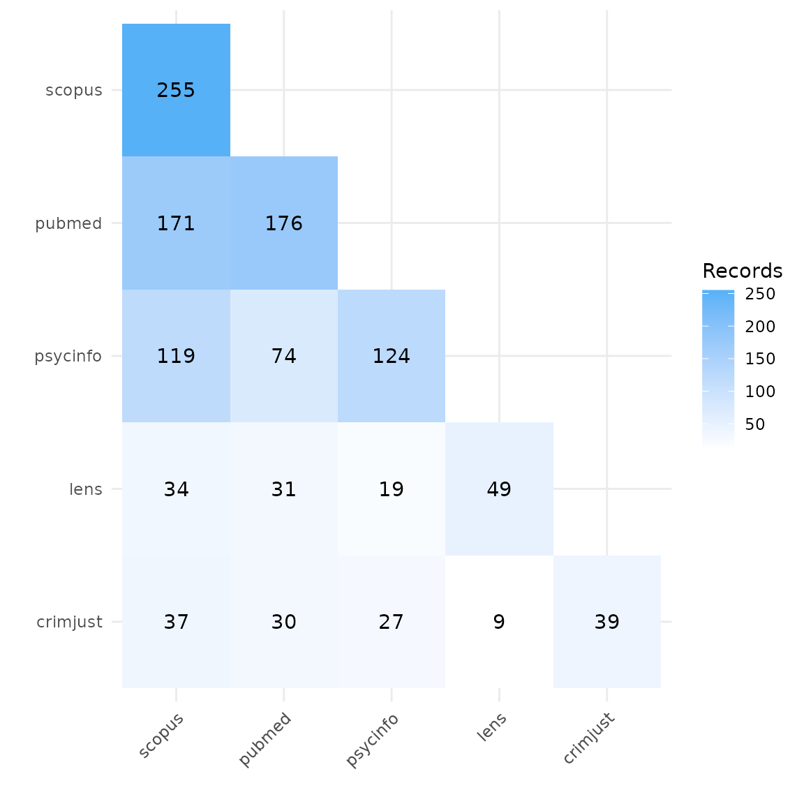
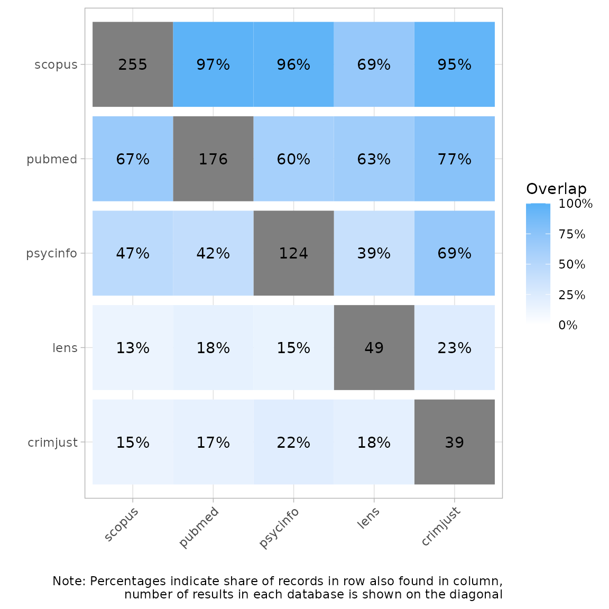
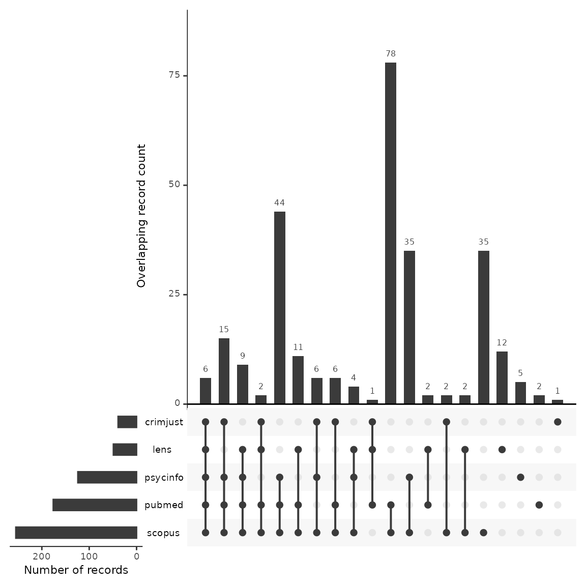
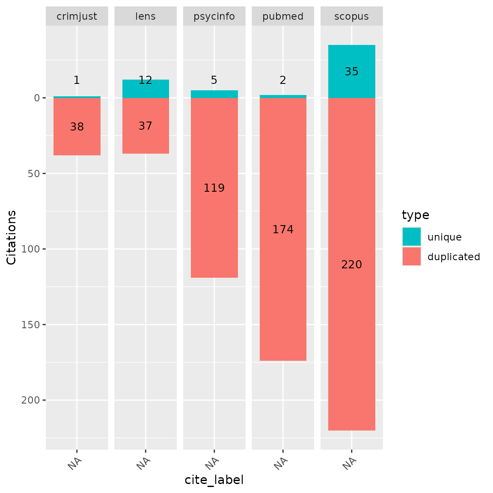
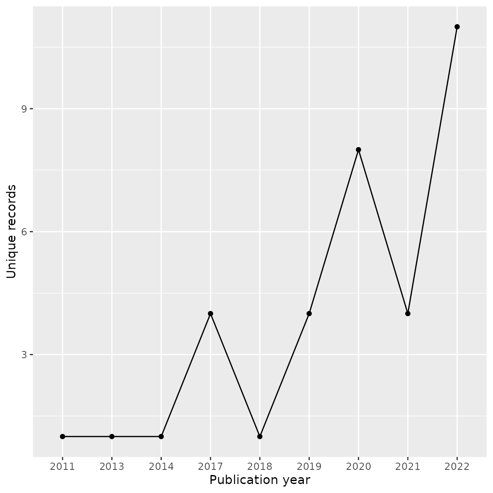
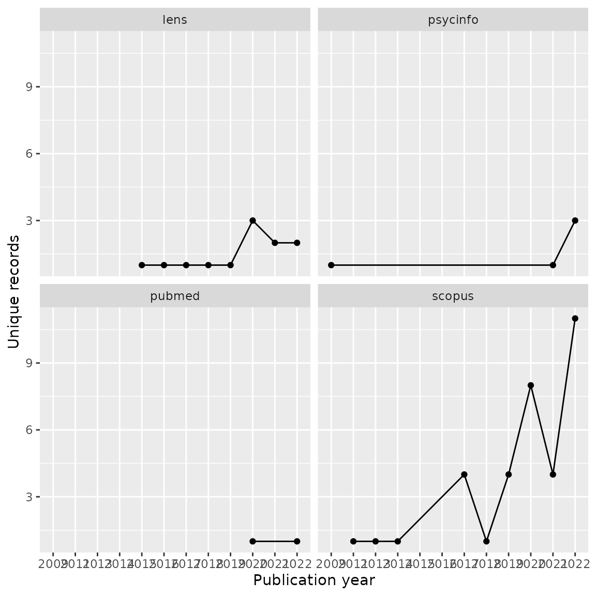

# Comparing Database Topic Coverage

## About this vignette

CiteSource can be used to examine topical overlap between databases. In
this example, we are interested in the overlap among databases, both
multi-disciplinary and subject-specific, for the literature on the
harmful effects of gambling addiction. To assess this, we ran a very
specific search for the term “gambling harm\*” in the title and abstract
fields of the following databases: Lens, Scopus, Criminal Justice
Abstracts, PsycInfo and Medline.

## Installation and setup

``` r

#install.packages("CiteSource")
library(CiteSource)
```

## Import files from multiple sources

Users can import multiple RIS or bibtex files into CiteSource, labeling
each with source information such as the database or platform it came
from.

``` r

citation_files <- list.files(path = "topic_data", pattern = "\\.ris", full.names = TRUE)

citations <- read_citations(citation_files,
                            cite_sources = c("crimjust", "lens", "psycinfo", "pubmed", "scopus"),
                            tag_naming = "best_guess")
#> Import completed - with the following details:
#>                                       file cite_source cite_string cite_label
#> 1  20221207_gambling-harms_crimjust_41.ris    crimjust        <NA>       <NA>
#> 2      20221207_gambling-harms_lens_49.ris        lens        <NA>       <NA>
#> 3 20221207_gambling-harms_psycinfo_124.ris    psycinfo        <NA>       <NA>
#> 4   20221207_gambling-harms_pubmed_176.ris      pubmed        <NA>       <NA>
#> 5   20221207_gambling-harms_scopus_255.ris      scopus        <NA>       <NA>
#>   citations
#> 1        41
#> 2        49
#> 3       124
#> 4       176
#> 5       255
```

## Deduplication and source information

CiteSource merges duplicate records while preserving the `cite_source`
metadata field, so the origin of each record is retained through
deduplication.

``` r

unique_citations <- dedup_citations(citations)
n_unique <- count_unique(unique_citations)
source_comparison <- compare_sources(unique_citations, comp_type = "sources")
```

## Plot heatmap to compare source overlap

### Heatmap by number of records

A heatmap shows the total number of records from each database and the
number of overlapping records for each pair. Here, Scopus yielded the
highest number of records on gambling harms, and Criminal Justice
Abstracts the least.

``` r

plot_source_overlap_heatmap(source_comparison)
```



### Heatmap by percentage of records

The percentage heatmap shows what share of each row’s records were also
found in each column. Here, 67% of records in Scopus were also found in
PubMed, while 97% of PubMed records were found in Scopus.

``` r

plot_source_overlap_heatmap(source_comparison, plot_type = "percentages")
```



## Plot an upset plot to compare source overlap

An upset plot provides more detail about shared and unique records
across all source combinations. Scopus had the most unique records
(n=35); Criminal Justice Abstracts had only one. Six records were found
in every database.

``` r

plot_source_overlap_upset(source_comparison, decreasing = c(TRUE, TRUE))
```



## Bar plots of unique and shared records

[`plot_contributions()`](https://www.eshackathon.org/CiteSource/reference/plot_contributions.md)
provides a convenient way to visualize unique and shared records by
source. The `center = TRUE` argument splits the bars so unique records
extend in one direction and shared records in the other.

``` r

plot_contributions(n_unique, center = TRUE)
```



## Analyzing unique contributions

To examine which records are only found in a single database, filter
`n_unique` for `unique == TRUE` and rejoin with `unique_citations` to
recover the full bibliographic data.

``` r

unique_lens      <- n_unique |> dplyr::filter(cite_source == "lens",     unique == TRUE) |> dplyr::inner_join(unique_citations, by = "duplicate_id")
unique_psycinfo  <- n_unique |> dplyr::filter(cite_source == "psycinfo", unique == TRUE) |> dplyr::inner_join(unique_citations, by = "duplicate_id")
unique_pubmed    <- n_unique |> dplyr::filter(cite_source == "pubmed",   unique == TRUE) |> dplyr::inner_join(unique_citations, by = "duplicate_id")
unique_crimjust  <- n_unique |> dplyr::filter(cite_source == "crimjust", unique == TRUE) |> dplyr::inner_join(unique_citations, by = "duplicate_id")
unique_scopus    <- n_unique |> dplyr::filter(cite_source == "scopus",   unique == TRUE) |> dplyr::inner_join(unique_citations, by = "duplicate_id")
```

### Analyze journal titles

Looking at the top journals producing unique records in Scopus that were
not found in any other database:

``` r

scopus_journals <- unique_scopus |>
  dplyr::group_by(journal) |>
  dplyr::summarise(count = dplyr::n()) |>
  dplyr::arrange(dplyr::desc(count))

knitr::kable(scopus_journals[1:10, ])
```

| journal | count |
|:---|---:|
| International Gambling Studies | 5 |
| Current Addiction Reports | 3 |
| International Journal of Mental Health and Addiction | 3 |
| Journal of Gambling Issues | 3 |
| Computers in Human Behavior | 2 |
| Journal of Public Health (Germany) | 2 |
| Applied Research in Quality of Life | 1 |
| Canadian Journal of Addiction | 1 |
| Cognition and Addiction: A Researcher’s Guide from Mechanisms Towards Interventions | 1 |
| Critical Public Health | 1 |

## Analyze publication years

Publication year analysis can reveal whether a database’s unique
contributions are concentrated in a particular time period. Here the
unique records from Scopus are mostly recent, which may indicate more
current coverage on gambling harms.

``` r

unique_scopus |>
  dplyr::group_by(year) |>
  dplyr::summarise(count = dplyr::n()) |>
  ggplot2::ggplot(ggplot2::aes(year, count, group = 1)) +
  ggplot2::geom_line() +
  ggplot2::geom_point() +
  ggplot2::xlab("Publication year") +
  ggplot2::ylab("Unique records")
```



We can also compare publication years of unique records across each
database using `facet_wrap`:

``` r

all_unique <- dplyr::bind_rows(unique_scopus, unique_lens, unique_pubmed, unique_psycinfo)

all_unique |>
  dplyr::group_by(cite_source.x, year) |>
  dplyr::summarise(count = dplyr::n()) |>
  ggplot2::ggplot(ggplot2::aes(year, count, group = 1)) +
  ggplot2::geom_line() +
  ggplot2::geom_point() +
  ggplot2::facet_wrap(~ cite_source.x) +
  ggplot2::xlab("Publication year") +
  ggplot2::ylab("Unique records")
```



## Exporting for further analysis

CiteSource can export deduplicated results as CSV, RIS, or BibTeX files,
and reimport them to resume analysis later.

``` r

#export_csv(unique_citations, filename = "unique-by-source.csv", separate = "cite_source")
#export_ris(unique_citations, filename = "unique_citations.ris", source_field = "DB", label_field = "N1")
#export_bib(unique_citations, filename = "unique_citations.bib", include = c("sources", "labels", "strings"))
#reimport_csv("unique-by-source.csv")
```

## In summary

CiteSource can evaluate coverage of different databases for a specific
topic. In this example, Scopus has the most content on gambling harms,
including the most unique content and the best coverage for earlier
years. Lens also contributes a proportionally large amount of unique
records, perhaps representing grey literature. Analysis of this kind can
help determine which databases to include in an evidence synthesis
search, or inform collection development decisions.
