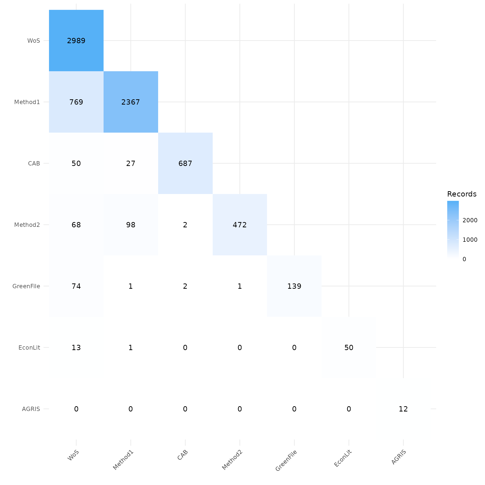
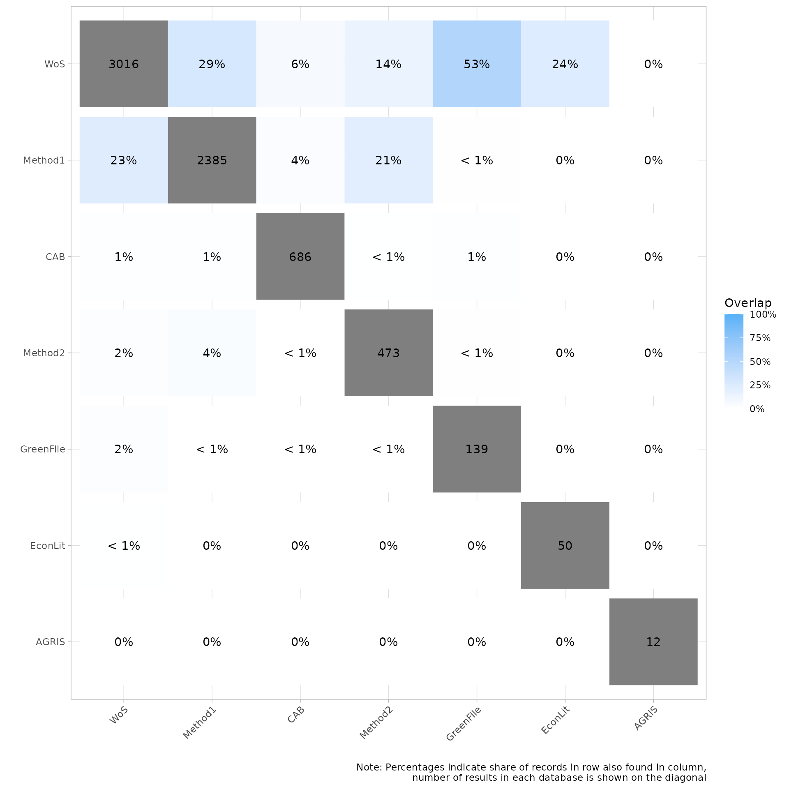
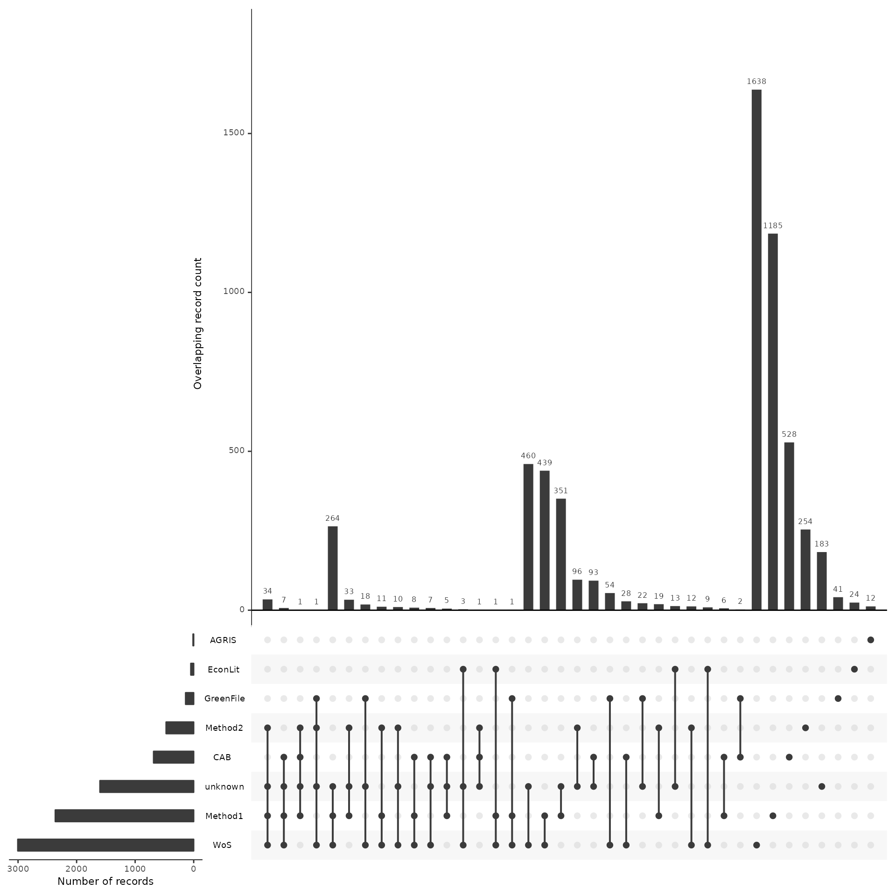
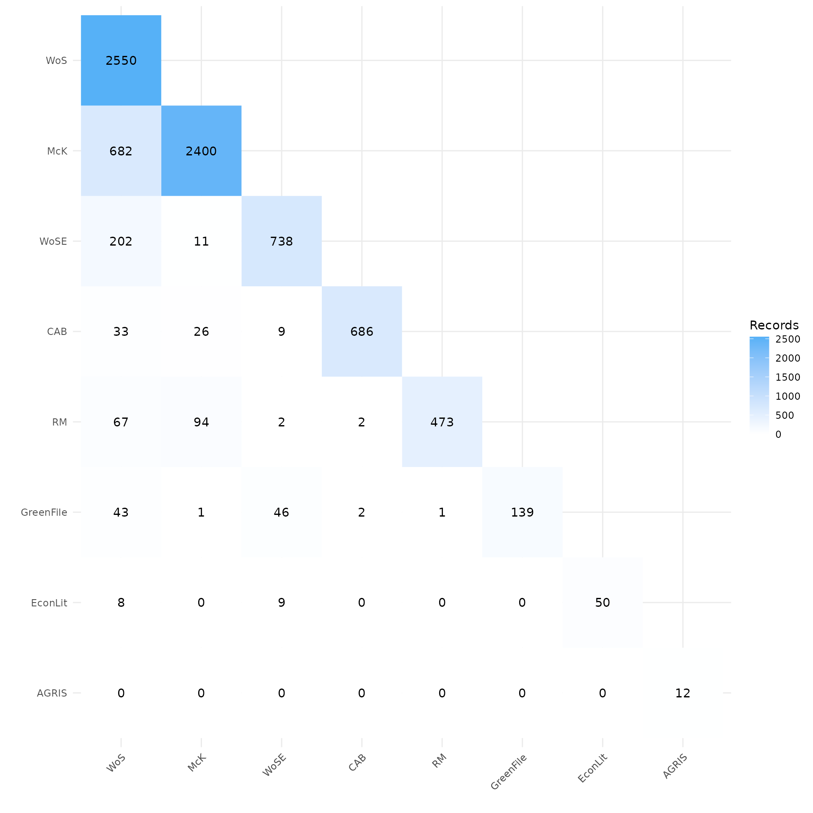

# Source Analysis Across Screening Phases

## About this vignette

In order to complete a reliable systematic search one must include
multiple resources to ensure the inclusion of all relevant studies. The
exact number of sources that are necessary for a thorough search can
vary depending on the topic, type of review, etc. Along with the
selection and search of traditional literature sources, other methods
such as hand searching relevant journals, citation chasing/snowballing,
searching websites, etc. can be used to minimize the risk of missing
relevant studies. But how important is that extra database? How much
return are you getting from the weeks worth of combing through websites?
Did that open resource perform just perform as well as (or better than)
the one your library/institution pays 500k/year for? How much time could
you save if you had these answers? Wouldn’t knowing the answers to these
questions give us a better understanding of HOW to conduct our searches?
Wouldn’t it be great it we could speed up the process without impacting
its quality, better yet, improve our understanding while making the
process faster?

These were some of the main questions that our team wanted to answer.
The goal of this vignette (which we’d love your feedback on) is to show
you how CiteSource can help you gather information on the ways sources
and methods impact a review. The data in this vignette is based on a
subset of data from an actual project. In it, we’ll walk through how
CiteSource can import original search results, compare those information
sources and methods, and determine how they contributed to the final
review.

If you have any questions, feedback, ideas, etc. about this vignette or
others be sure to check out our [discussion
board](https://github.com/ESHackathon/CiteSource/discussions/100) on
github!

## 1. Installation of packages and loading libraries

Use the following code to install CiteSource. Currently, CiteSource
lives on GitHub, so you may need to first install the remotes package.
This vignette also uses functions from the *ggplot2* and *dplyr*
packages.

``` r

#Install the remotes packages to enable installation from GitHub
#install.packages("remotes")
#library(remotes)

#Install CiteSource
#remotes::install_github("ESHackathon/CiteSource")

#Load the necessary libraries
library(CiteSource)
library(dplyr)
```

## 2. Import Reference Files and Add Custom Metadata

Users can import multiple .ris or .bib files into CiteSource, which they
can then label with three custom metadata fields: cite_source,
cite_string, and cite_label.

Using the cite_source field, the user can label individual files with
source information such as database or platform. Beyond source
information, users may also use the cite_source field to provide search
results using various search methodologies.

The second field, cite_label, can be used to apply yet another variable.
This label was intended to be used in combination with the label
cite_source, to track the inclusion or exclusion of citations from a
specific source over the course of title/abstract and full text
screening.

As a note, CiteSource does provide a third metadata field, cite_string,
which can be used to specify another attribute or variable. For example,
a use of cite_source and cite_string may be to examine the unique and
crossover citations that occur between databases, while simultaneously
evaluating unique search string results. While it’s possible to use
cite_string, we have not fully integrated this third field into any of
our tables and plots and it is not used in this vignette. As we continue
to develop CiteSource and get feedback from users, we’ll continue to
update this and other vignettes.

### Indicate file location

``` r

#Import citation files from a folder
citation_files <- list.files(path = file.path("../vignettes/working_example_data"), pattern = "\\.ris", full.names = TRUE)

#Print citation_files to double check the order in which R imported the files.
citation_files
#>  [1] "../vignettes/working_example_data/AGRIS.ris"    
#>  [2] "../vignettes/working_example_data/CAB.ris"      
#>  [3] "../vignettes/working_example_data/EconLit.ris"  
#>  [4] "../vignettes/working_example_data/Final.ris"    
#>  [5] "../vignettes/working_example_data/GreenFile.ris"
#>  [6] "../vignettes/working_example_data/McK.ris"      
#>  [7] "../vignettes/working_example_data/RM.ris"       
#>  [8] "../vignettes/working_example_data/TiAb.ris"     
#>  [9] "../vignettes/working_example_data/WoS_early.ris"
#> [10] "../vignettes/working_example_data/WoS_later.ris"
```

## 3. Read in citation files and add custom metadata

Prior to importing files into CiteSource, it is recommended that users
import raw .ris/.bib files into a citation management software such as
EndNote or Zotero and combine multiple citation files from each
individual source. This can reduce complication and assist with applying
metadata. Features such as EndNote’s “find reference updates” can also
ensure that citations are more complete by filling in missing metadata
fields.

In this example, we read in the citaiton files and tag the citation
files with the resource they came from using the cite_source field. The
two citation files labeled NA represent the file from included papers
after title/abstract screening and the file of the included papers after
full-text screening and therefore are not assigned a source. The
cite_label tag is being used to tag files with “search” (the initial
search results), “screened” (included papers after TI/AB screening), and
“final” (papers included after full-text screening).

``` r

# Import citation files from folder
citation_files <- list.files(path = "working_example_data", pattern = "\\.ris", full.names = TRUE)

# Print list of citation files to console
citation_files
#>  [1] "working_example_data/AGRIS.ris"     "working_example_data/CAB.ris"      
#>  [3] "working_example_data/EconLit.ris"   "working_example_data/Final.ris"    
#>  [5] "working_example_data/GreenFile.ris" "working_example_data/McK.ris"      
#>  [7] "working_example_data/RM.ris"        "working_example_data/TiAb.ris"     
#>  [9] "working_example_data/WoS_early.ris" "working_example_data/WoS_later.ris"

# Set the path to the directory containing the citation files
file_path <- "../vignettes/working_example_data/"

metadata_tbl <- tibble::tribble(
  ~files,           ~cite_sources, ~cite_labels, 
   "AGRIS.ris",      "AGRIS",       "search",    
   "CAB.ris",        "CAB",         "search",    
   "EconLit.ris",    "EconLit",     "search",    
   "Final.ris",       NA,           "final",     
   "GreenFile.ris",  "GreenFile",   "search",    
   "McK.ris",        "Method1",     "search",    
   "RM.ris",         "Method2",     "search",    
   "TiAb.ris",        NA,           "screened",  
   "WoS_early.ris",  "WoS",         "search",    
   "WoS_later.ris",  "WoS",         "search"
) %>% 

dplyr::mutate(files = paste0(file_path, files))
citations <- read_citations(metadata = metadata_tbl)
#> Importing files ■■■                                5%
#> Importing files ■■■                                6%
#> Importing files ■■■                                8%
#> Importing files ■■■■                               9%
#> Import completed - with the following details:
#>             file cite_source cite_string cite_label citations
#> 1      AGRIS.ris       AGRIS        <NA>     search        12
#> 2        CAB.ris         CAB        <NA>     search       687
#> 3    EconLit.ris     EconLit        <NA>     search        50
#> 4      Final.ris        <NA>        <NA>      final       242
#> 5  GreenFile.ris   GreenFile        <NA>     search       139
#> 6        McK.ris     Method1        <NA>     search      2656
#> 7         RM.ris     Method2        <NA>     search       530
#> 8       TiAb.ris        <NA>        <NA>   screened      1573
#> 9  WoS_early.ris         WoS        <NA>     search      2550
#> 10 WoS_later.ris         WoS        <NA>     search       736
```

## 4. Deduplication & Identifying Crossover Records

CiteSource allows users to merge duplicate records, while maintaining
information in the cite_source, cite_label,and cite_string fields.

Note that duplicates are assumed to published in the same source, so
pre-prints and similar results will not be identified as duplicates.

``` r

unique_citations <- dedup_citations(citations)
#> Registered S3 method overwritten by 'synthesisr':
#>   method                     from      
#>   as.data.frame.bibliography CiteSource
#> formatting data...
#> identifying potential duplicates...
#> identified duplicates!
#> flagging potential pairs for manual dedup...
#> Joining with `by = join_by(duplicate_id.x, duplicate_id.y)`
#> 9175 citations loaded...
#> 3323 duplicate citations removed...
#> 5852 unique citations remaining!

# Count number of unique and non-unique citations from different sources and labels
n_unique <- count_unique(unique_citations)

# Create dataframe indicating occurrence of records across sources
source_comparison <- compare_sources(unique_citations, comp_type = "sources")

# initial upload/post internal deduplication table creation
initial_counts<-record_counts(unique_citations, citations, "cite_source")
record_counts_table(initial_counts)
```

| Record Counts |  |  |
|----|----|----|
|  | Records Imported¹ | Distinct Records² |
| AGRIS | 12 | 12 |
| CAB | 687 | 687 |
| EconLit | 50 | 50 |
| GreenFile | 139 | 139 |
| Method1 | 2656 | 2367 |
| Method2 | 530 | 472 |
| WoS | 3286 | 2989 |
| Total | 7360 | 6716 |
| ¹ Number of records imported from each source. |  |  |
| ² Number of records after internal source deduplication |  |  |

## 5. Analyzing Sources & Methods

When teams are selecting databases for inclusion in a review it can be
extremely difficult to determine the best resources and determine the
ROI in terms of the time it takes to apply searches. This is especially
true in fields where research relies on cross-disciplinary resources. By
tracking and reporting where/how each citation was found, the evidence
synthesis community could in turn track the utility of various
databases/platforms and identify the most relevant resources as it
relates to their research topic. This idea can be extended to search
string comparison as well as various search strategies and
methodologies.

### Plot overlap as a heatmap matrix

CiteSource performs citation analysis and deduplication within each
source file, prior to comparing sources across source files. This
heatmap shows the number of citations unique to each source at the top
of the source’s column. The heatmap also provides a count of citations
that were found at the intersection of each source.

In this case, you can see that the source tag “Method 1” only shows 2364
records, while the initial .ris file contained 2656 citations. This
means that CiteSource identified duplicate references within that
citation list. The 2364 remaining citations are attributed to this
source. Looking at the source Greenfile, we can see that CiteSource did
not find any duplicate citations within this source as both counts read
139.

``` r

my_heatmap <- plot_source_overlap_heatmap(source_comparison)

my_heatmap
```



### Plot overlap as a heatmap matrix as percentage

The following heatmap provides an overview of the overlapping citations
by percent of each source’s count. For example the EconLit source
contains 50 citations. Of those 50 we can see on the previous heatmap
that 8 of these citations were also in the source WoSE, which represents
16% of the citations from EconLit. On the other hand the same 8
citations only represent .3% of the total citations from WoSE.
(currently this chart is set to display only whole numbers - we are
considering changing this to display to the first decimal)

``` r

my_heatmap_percent <- plot_source_overlap_heatmap(source_comparison, plot_type = "percentages")

my_heatmap_percent
```



### Plot overlap as an upset plot

``` r

my_upset_plot <- plot_source_overlap_upset(source_comparison, decreasing = c(TRUE, TRUE))
#> Plotting a large number of groups. Consider reducing nset or sub-setting the data.

my_upset_plot
```



## 6. Analyzing records after screening

Once the title and abstract screening has been completed or once the
final papers have been selected, users can analyze the contributions of
each source or search method to these screening phases to better
understand their impact on the review. By using the “cite_source” data
along with the “cite_label” data, users can analyze the number of
overlapping/unique records from each source or method.

### Assessing contribution of sources by review stage

``` r

my_contributions <- plot_contributions(n_unique,
  center = TRUE,
  bar_order = c("search", "screened", "final")
)

my_contributions
```



### Analyzing Precision/Sensitivity

In addition to the above visualizations, it may be useful to export
tables for additional analysis. Presenting data in the form of a search
summary table can provide an overview of each source’s impact as well as
precision and sensitivity (see [Bethel et
al. 2021](https://doi.org/10.5195/jmla.2021.809) for more about search
summary tables).

``` r

calculated_counts<-calculate_record_counts(unique_citations, citations, n_unique, "cite_source")
record_summary_table(calculated_counts)
```

| Record Counts |  |  |  |  |  |  |  |
|----|----|----|----|----|----|----|----|
|  | Records Imported¹ | Distinct Records² | Unique records³ | Non-unique Records⁴ | Records Contributed %⁵ | Unique Records Contributed %⁶ | Unique Records %⁷ |
| AGRIS | 12 | 12 | 12 | 0 | 0.2% | 0.3% | 100.0% |
| CAB | 687 | 687 | 622 | 65 | 10.2% | 13.2% | 90.5% |
| EconLit | 50 | 50 | 37 | 13 | 0.7% | 0.8% | 74.0% |
| GreenFile | 139 | 139 | 63 | 76 | 2.1% | 1.3% | 45.3% |
| Method1 | 2656 | 2367 | 1534 | 833 | 35.2% | 32.7% | 64.8% |
| Method2 | 530 | 472 | 350 | 122 | 7.0% | 7.5% | 74.2% |
| WoS | 3286 | 2989 | 2078 | 911 | 44.5% | 44.3% | 69.5% |
| Total | 7360 | ⁸ 5852 | 4696 | 2020 | NA | NA | NA |
| ¹ Number of raw records imported from each database. |  |  |  |  |  |  |  |
| ² Number of records after internal source deduplication |  |  |  |  |  |  |  |
| ³ Number of records not found in another source. |  |  |  |  |  |  |  |
| ⁴ Number of records found in at least one other source. |  |  |  |  |  |  |  |
| ⁵ Percent distinct records contributed to the total number of distinct records. |  |  |  |  |  |  |  |
| ⁶ Percent of unique records contributed to the total unique records. |  |  |  |  |  |  |  |
| ⁷ Percentage of records that were unique from each source. |  |  |  |  |  |  |  |
| ⁸ Total citations discoverd (after internal and cross-source deduplication) |  |  |  |  |  |  |  |

``` r

phase_counts<-calculate_phase_count(unique_citations, citations, "cite_source")
precision_sensitivity_table(phase_counts)
```

| Record Counts & Precision/Sensitivity |  |  |  |  |  |
|----|----|----|----|----|----|
|  | Distinct Records¹ | Screened Included² | Final Included³ | Precision⁴ | Sensitivity/Recall⁵ |
| AGRIS | 12 | 0 | 0 | 0 | 0 |
| CAB | 687 | 117 | 4 | 0.58 | 1.65 |
| EconLit | 50 | 16 | 3 | 6 | 1.24 |
| GreenFile | 139 | 41 | 4 | 2.88 | 1.65 |
| Method1 | 2367 | 695 | 113 | 4.77 | 46.69 |
| Method2 | 472 | 177 | 51 | 10.81 | 21.07 |
| WoS | 2989 | 805 | 115 | 3.85 | 47.52 |
| Total | ⁶ 5852 | ⁷ 1573 | ⁸ 242 | ⁹ 4.14 | NA |
| ¹ Number of records after internal source deduplication |  |  |  |  |  |
| ² Number of citations included after title/abstract screening |  |  |  |  |  |
| ³ Number of citations included after full text screening |  |  |  |  |  |
| ⁴ Number of final included citations / Number of distinct records |  |  |  |  |  |
| ⁵ Number of final included citations / Total number of final included citations |  |  |  |  |  |
| ⁶ Total citations discoverd (after internal and cross-source deduplication) |  |  |  |  |  |
| ⁷ Total citations included after Ti/Ab Screening |  |  |  |  |  |
| ⁸ Total citations included after full text screening |  |  |  |  |  |
| ⁹ Overall Precision = Number of final included citations / Total distinct records |  |  |  |  |  |

### Creating a Citation Record Table

Another useful table that can be exported as a .csv is the record-level
table. This table allows users to quickly identify which individual
citations in the screened and/or final records were present/absent from
each source. The source tag is the default (include = “sources”), but
can be replaced or expanded with ‘labels’ and/or ‘strings’

``` r

unique_citations %>%
  dplyr::filter(stringr::str_detect(cite_label, "final")) %>%
  record_level_table(return = "DT")
```

## 7. Exporting for further analysis

We may want to export our deduplicated set of results (or any of our
dataframes) for further analysis or to save them in a convenient format
for subsequent use. CiteSource offers a set of export functions called
`export_csv`, `export_ris` and `export_bib` that will save dataframes as
a .csv file, .ris file or .bib file, respectively.

You can then reimport exported files to pick up a project or analysis
without having to start from scratch, or after making manual adjustments
(such as adding missing abstract data) to a file.

Generate a .csv file. The separate argument can be used to create
separate columns for cite_source, cite_label or cite_string to
facilitate analysis.

``` r

#export_csv(unique_citations, filename = "citesource_working_example.csv", separate = "cite_source")
```

Generate a .ris file and indicate custom field location for cite_source,
cite_label or cite_string. In this example, we’ll be using EndNote, so
we put cite_sources in the DB field, which will appear as the *Name of
Database* field in EndNote and cite_labels into C5, which will appear as
the *Custom 5* metadata field in EndNote.

``` r

#export_ris(unique_citations, filename = "citesource_working_example.ris", source_field = "DB", label_field = "C5")
```

Generate a bibtex file and include data from cite_source, cite_label or
cite_string.

``` r

#export_bib(unique_citations, filename = "citesource_working_example.bib", include = c("sources", "labels", "strings"))
```

In order to reimport a .csv or a .ris you can use the follwowing. Here
is an example of how you would reimport the file if it were on your
desktop

``` r

#citesource_working_example <-reimport_csv("citesource_working_example.csv")

#citesource_working_example <-reimport_ris("citesource_working_example.ris")
```
